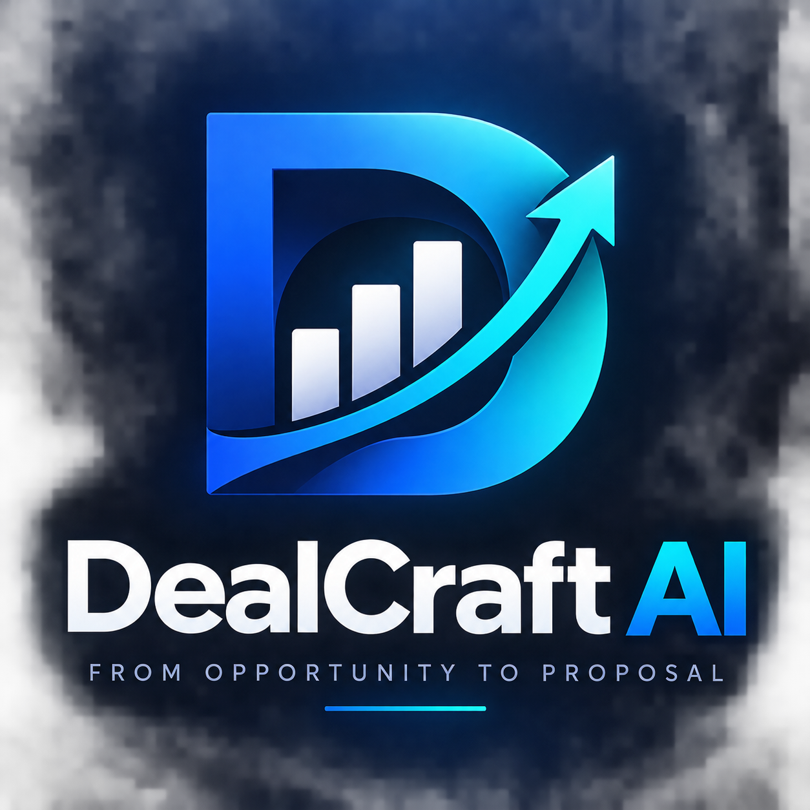

<p align="center">
  
</p>

# DealCraft AI

> Transforme oportunidades comerciais em propostas estruturadas, consistentes e prontas para decisão.

**DealCraft AI** é um sistema de apoio à estruturação de oportunidades comerciais B2B e à geração controlada de propostas comerciais.

O projeto transforma informações de um briefing comercial em uma oportunidade estruturada, avalia sua completude, identifica lacunas, valida regras comerciais e somente permite a geração da proposta quando os requisitos necessários forem atendidos.

A solução foi projetada com um princípio central:

> **A IA pode apoiar a estruturação da oportunidade, mas não deve inventar informações comerciais nem substituir a decisão humana.**

---

## Visão geral

Em processos comerciais B2B, propostas frequentemente são construídas a partir de informações dispersas em reuniões, anotações, e-mails e briefings.

Isso pode gerar problemas como:

- informações importantes ausentes;
- propostas criadas antes do entendimento adequado da oportunidade;
- preços fora das faixas comerciais;
- descontos inconsistentes;
- prazos incompatíveis com o serviço;
- ausência de informações sobre o processo decisório;
- geração de propostas baseada em suposições;
- falta de padronização entre diferentes oportunidades.

O DealCraft AI foi desenvolvido para organizar esse processo.

Antes de gerar qualquer documento comercial, o sistema verifica se existem informações suficientes e se a oportunidade respeita as regras definidas pela empresa.

---

## Objetivo

O objetivo do DealCraft AI é transformar:

```text
Briefing comercial
        ↓
Oportunidade estruturada
        ↓
Validação
        ↓
Proposta comercial
```

em um processo controlado, rastreável e orientado por regras.

O sistema não tenta prever se uma venda será fechada.

Ele verifica se existem **informações suficientes para estruturar corretamente a oportunidade comercial**.

---

## Arquitetura do processo

```text
                 DEALCRAFT AI
                      │
               ┌──────┴──────┐
               │             │
           BRIEFING      GUIA 5 ETAPAS
               │             │
               └──────┬──────┘
                      ↓
              DATA EXTRACTION
                      ↓
            OPPORTUNITY MODEL
                      ↓
          OPPORTUNITY READINESS
                      ↓
               GAP ANALYSIS
                      ↓
           SOLUTION MATCHING
                      ↓
        COMMERCIAL RULES ENGINE
                      ↓
             EXECUTIVE SUMMARY
                      ↓
              USER APPROVAL
                      ↓
           PROPOSAL GENERATION
                      ↓
                   .DOCX
```

A arquitetura separa claramente três responsabilidades:

**estruturação da informação → validação comercial → geração documental**

Essa separação reduz o risco de gerar propostas baseadas em informações incompletas ou inconsistentes.

---

# Opportunity Model

O DealCraft AI organiza uma oportunidade comercial em cinco grupos de informação.

## A — Cliente

| Campo | Informação |
|---|---|
| A1 | Razão social |
| A2 | Setor |
| A3 | Porte |
| A4 | Localização |
| A5 | Contato principal |
| A6 | Cargo |
| A7 | E-mail |
| A8 | Telefone |

---

## B — Oportunidade

| Campo | Informação |
|---|---|
| B1 | Cenário atual |
| B2 | Principal problema / dor |
| B3 | Objetivo do projeto |
| B4 | Impacto |
| B5 | Urgência |
| B6 | Prazo desejado |
| B7 | Orçamento |

---

## C — Processo decisório

| Campo | Informação |
|---|---|
| C1 | Decisor |
| C2 | Influenciadores |
| C3 | Critérios de decisão |
| C4 | Concorrentes |
| C5 | Próximo passo comercial |
| C6 | Data do próximo contato |

---

## D — Solução

| Campo | Informação |
|---|---|
| D1 | Serviço(s) recomendado(s) |
| D2 | Escopo |
| D3 | Prazo |
| D4 | Investimento por serviço |
| D5 | Desconto |
| D6 | Premissas |
| D7 | Exclusões |

---

## E — Controle interno

| Campo | Informação |
|---|---|
| E1 | Número da proposta |
| E2 | Consultor |
| E3 | E-mail do consultor |
| E4 | Data de emissão |
| E5 | Idioma |
| E6 | Observações |

---

# Opportunity Readiness

Um dos componentes centrais do DealCraft AI é o **Opportunity Readiness**.

Ele é um diagnóstico determinístico de completude da oportunidade.

Não representa:

- probabilidade de fechamento;
- lead scoring;
- previsão de receita;
- previsão de conversão.

O objetivo é responder:

> **Temos informações suficientes para estruturar esta oportunidade de maneira responsável?**

São avaliadas oito dimensões:

| Dimensão | Critério |
|---|---|
| Cliente | Cliente identificado |
| Problema | Problema comercial definido |
| Objetivo | Objetivo do projeto definido |
| Impacto | Impacto conhecido |
| Decisor | Processo decisório identificado |
| Orçamento | Orçamento informado |
| Prazo | Prazo conhecido |
| Solução | Solução definida |

Cada dimensão recebe:

```text
1 = informação disponível
0 = informação ausente
```

O cálculo é:

```text
Opportunity Readiness =
dimensões disponíveis / 8 × 100
```

Classificação:

| Resultado | Classificação |
|---|---|
| 0–49% | BAIXA COMPLETUDE |
| 50–74% | COMPLETUDE PARCIAL |
| 75–99% | BOA COMPLETUDE |
| 100% | COMPLETUDE TOTAL |

O indicador mede **completude da oportunidade**, e não chance de venda.

---

# Gap Analysis

Após estruturar a oportunidade, o sistema identifica informações obrigatórias ausentes.

Exemplos:

```text
A7 — E-mail
B3 — Objetivo do projeto
B5 — Urgência
D1 — Serviço recomendado
D2 — Escopo
D3 — Prazo
D4 — Investimento
E1 — Número da proposta
E4 — Data de emissão
```

Quando existem lacunas obrigatórias, o fluxo é interrompido.

O sistema não deve completar esses campos por inferência.

---

# Catálogo de serviços

O DealCraft AI utiliza um catálogo estruturado de serviços.

| Serviço | Prazo | Faixa de investimento |
|---|---:|---:|
| Diagnóstico de Transformação Digital | 10–20 dias | R$ 12.000–25.000 |
| CRM & Automação Comercial | 30–60 dias | R$ 30.000–70.000 |
| Marketing & Growth Intelligence | 30–60 dias | R$ 25.000–60.000 |
| Data Analytics & BI | 30–75 dias | R$ 35.000–85.000 |
| Automação com IA | 30–90 dias | R$ 40.000–120.000 |
| Agentes de IA para Negócios | 30–75 dias | R$ 45.000–110.000 |
| Integração de Sistemas & Dados | 30–90 dias | R$ 40.000–100.000 |
| Capacitação & AI Enablement | 5–20 dias | R$ 10.000–30.000 |

O catálogo possui uma representação estruturada em JSON utilizada pelo mecanismo de validação.

---

# Commercial Rules Engine

Antes da geração da proposta, o DealCraft AI verifica as regras comerciais da operação.

Entre as regras implementadas estão:

- moeda padrão em BRL;
- validade da proposta de 30 dias corridos;
- investimento dentro da faixa definida no catálogo;
- prazo dentro da faixa permitida para o serviço;
- desconto permitido apenas para contratação de dois ou mais serviços;
- faixa de desconto permitida entre 5% e 15%;
- oportunidades a partir de R$ 200.000 exigem revisão comercial;
- serviços inexistentes no catálogo não podem ser inventados;
- informações ausentes não podem ser preenchidas artificialmente.

---

# Condições de pagamento

O padrão comercial utilizado pelo projeto é:

```text
30% — contratação
40% — marco intermediário
30% — entrega
```

O sistema calcula automaticamente os valores absolutos de cada parcela.

Exemplo para uma proposta de R$ 60.000:

```text
30% = R$ 18.000
40% = R$ 24.000
30% = R$ 18.000
```

---

# Estados da oportunidade

Após as validações, o DealCraft AI pode retornar os seguintes estados:

```text
APROVADO PARA RESUMO EXECUTIVO
REQUER INFORMAÇÕES
REQUER VALIDAÇÃO HUMANA
BLOQUEADO
```

Somente oportunidades elegíveis seguem para a etapa de resumo executivo.

---

# Human-in-the-Loop

A geração da proposta possui uma etapa explícita de aprovação humana.

Mesmo depois de todas as validações automáticas, o documento não é criado imediatamente.

Primeiro, o DealCraft AI apresenta um **Resumo Executivo da Oportunidade**.

Depois, o usuário precisa confirmar explicitamente:

```text
APROVAR
```

Somente após essa confirmação o documento `.docx` é gerado.

Esse mecanismo mantém a decisão comercial final sob responsabilidade humana.

---

# Guardrails contra alucinação

O DealCraft AI foi projetado para evitar a criação artificial de informações comerciais.

O sistema não deve inventar:

- clientes;
- orçamento;
- impacto;
- concorrentes;
- decisores;
- necessidades;
- serviços;
- preços;
- descontos;
- prazos;
- resultados esperados.

Quando uma informação não existe, ela deve ser tratada como:

```text
não informado
```

Se o campo for obrigatório, o sistema solicita complementação ou bloqueia o fluxo.

---

# Geração da proposta

Após a validação e aprovação humana, o DealCraft AI gera automaticamente uma proposta comercial profissional em formato:

```text
.docx
```

Estrutura do documento:

```text
CAPA

01 — Contexto e oportunidade

02 — Solução proposta

03 — Escopo e entregáveis

04 — Cronograma

05 — Investimento

06 — Próximos passos
```

O documento inclui:

- identidade visual;
- dados do cliente;
- contexto da oportunidade;
- solução proposta;
- escopo;
- cronograma;
- investimento;
- condições de pagamento;
- validade da proposta;
- próximo passo comercial;
- responsável pela proposta;
- paginação automática.

---

# Identidade visual

A empresa fictícia utilizada no projeto é:

## NEXORA CONSULTING

**Data · AI · Growth · Automation**

Paleta principal:

| Elemento | Cor |
|---|---|
| Navy | `#14213D` |
| Blue | `#2563EB` |
| Cyan | `#06B6D4` |
| Graphite | `#1F2937` |
| Slate | `#64748B` |
| Cloud | `#F8FAFC` |
| Border | `#E2E8F0` |

Tipografia principal:

```text
Aptos
```

Fallback:

```text
Arial
Calibri
```

---

# Estrutura do projeto

```text
DealCraft-AI/
│
├── DOCS/
│   ├── brand-book.json
│   ├── business-rules.md
│   ├── catalogo-servicos-dealcraft.md
│   ├── catalogo-servicos.json
│   └── template-proposta.docx
│
├── examples/
│   ├── briefing-completo.txt
│   └── briefing-incompleto.txt
│
├── outputs/
│   └── propostas geradas
│
├── skill/
│   └── SKILL.md
│
├── build_template.py
├── dealcraft_validator.py
├── dealcraft_summary.py
├── dealcraft_proposal.py
└── README.md
```

---

# Componentes

## `dealcraft_validator.py`

Responsável por:

- extração das informações;
- construção do Opportunity Model;
- identificação de campos ausentes;
- Opportunity Readiness;
- leitura do catálogo;
- validação de preços;
- validação de prazos;
- validação de descontos;
- condições de pagamento;
- regras comerciais;
- definição do status da oportunidade.

---

## `dealcraft_summary.py`

Responsável por:

- criação do resumo executivo;
- apresentação das informações validadas;
- preparação da oportunidade para decisão humana;
- solicitação explícita de aprovação.

---

## `dealcraft_proposal.py`

Responsável por:

- executar a validação;
- apresentar o resumo executivo;
- solicitar aprovação;
- gerar a proposta;
- aplicar identidade visual;
- construir tabelas;
- controlar paginação;
- gerar o arquivo `.docx`.

---

## `build_template.py`

Responsável pela construção do template documental utilizado como referência do projeto.

---

# Requisitos

O projeto utiliza Python.

Dependência principal:

```text
python-docx
```

Instalação:

```bash
pip install python-docx
```

---

# Como executar

Clone o repositório:

```bash
git clone https://github.com/SEU-USUARIO/DealCraft-AI.git
```

Entre no diretório:

```bash
cd DealCraft-AI
```

Instale a dependência:

```bash
pip install python-docx
```

---

## Validar uma oportunidade

```bash
python dealcraft_validator.py examples/briefing-completo.txt
```

Para visualizar o modelo extraído:

```bash
python dealcraft_validator.py examples/briefing-completo.txt --debug
```

---

## Gerar resumo executivo

```bash
python dealcraft_summary.py examples/briefing-completo.txt
```

---

## Executar o fluxo completo

```bash
python dealcraft_proposal.py examples/briefing-completo.txt
```

O sistema:

```text
valida
   ↓
estrutura
   ↓
calcula readiness
   ↓
verifica regras
   ↓
gera resumo
   ↓
solicita aprovação
   ↓
gera proposta
```

Quando solicitado, digite:

```text
APROVAR
```

---

# Cenários de teste

O projeto possui dois briefings de referência.

## Cenário positivo

```text
examples/briefing-completo.txt
```

Resultado esperado:

```text
Opportunity Readiness: 100%
Campos obrigatórios: 17/17
Status: APROVADO PARA RESUMO EXECUTIVO
```

Após aprovação humana:

```text
PROPOSTA GERADA COM SUCESSO
```

---

## Cenário negativo

```text
examples/briefing-incompleto.txt
```

O sistema identifica campos obrigatórios ausentes e interrompe o processo.

Resultado esperado:

```text
REQUER INFORMAÇÕES
```

Nenhuma proposta deve ser gerada.

---

# Exemplo validado

Durante os testes do projeto foi utilizada uma oportunidade fictícia da empresa:

```text
TechNova Distribuição Ltda.
```

Serviço:

```text
CRM & Automação Comercial
```

Investimento:

```text
R$ 60.000
```

Prazo:

```text
60 dias
```

Opportunity Readiness:

```text
8/8 dimensões
100%
COMPLETUDE TOTAL
```

O fluxo completo foi validado:

```text
Briefing
   ↓
Extração
   ↓
Opportunity Model
   ↓
Opportunity Readiness
   ↓
Gap Analysis
   ↓
Commercial Rules Engine
   ↓
Executive Summary
   ↓
Human Approval
   ↓
DOCX
```

---

# Princípios do projeto

O DealCraft AI foi construído com cinco princípios:

### 1. Não inventar dados comerciais

Informações inexistentes permanecem inexistentes.

### 2. Validar antes de gerar

A proposta é consequência da validação, não o início do processo.

### 3. Separar completude de previsão

Opportunity Readiness não representa probabilidade de fechamento.

### 4. Aplicar regras determinísticas

Preço, prazo, desconto e condições comerciais são controlados por regras explícitas.

### 5. Manter decisão humana

A proposta só é criada após aprovação explícita do usuário.

---

# Roadmap

Possíveis evoluções futuras:

```text
Interface web com Streamlit
        ↓
Persistência das oportunidades
        ↓
Suporte avançado a múltiplos serviços
        ↓
Histórico de aprovações
        ↓
Brand Book totalmente dinâmico
        ↓
Templates comerciais configuráveis
        ↓
Integração com CRM
        ↓
LLM para extração semântica
        ↓
RAG sobre catálogo e regras comerciais
        ↓
API
        ↓
Analytics comercial
```

Essas funcionalidades não fazem parte do núcleo validado da versão atual.

---

# Tecnologias

- Python
- python-docx
- JSON
- Markdown
- Microsoft Word / DOCX
- Git
- GitHub

---

# Contexto de desenvolvimento

O DealCraft AI foi desenvolvido como projeto prático de aplicação de conceitos de **Agentes de IA para Negócios**, combinando automação, engenharia de regras, estruturação de dados, validação comercial e Human-in-the-Loop.

O projeto parte de um problema real de processos comerciais B2B: transformar informações não estruturadas de uma oportunidade em uma proposta comercial consistente sem permitir que automação ou IA preencham lacunas com informações não verificadas.

---

# Autor

**Marcus Guedes**

Marketing · Gestão · Inteligência Artificial · Data Analytics · Projetos · Transformação Digital

GitHub: `MCLG1661`

---

## Status do projeto

**DealCraft AI v1.0 — Núcleo técnico concluído e validado.**

```text
Opportunity Model        ✅
Opportunity Readiness    ✅
Gap Analysis             ✅
Service Catalog          ✅
Commercial Rules Engine  ✅
Executive Summary        ✅
Human Approval           ✅
DOCX Generation          ✅
Positive E2E Test        ✅
Negative E2E Test        ✅
```

---

**DealCraft AI**

*Transforme oportunidades comerciais em propostas estruturadas, consistentes e prontas para decisão.*

